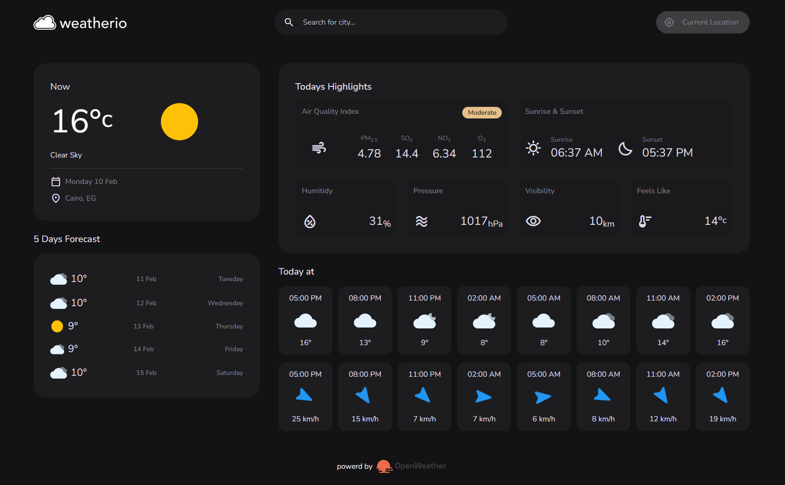

# Weather.IO

🌥️ Real-time weather app build with React.js

[Weather.io](https://weatherio-mz.netlify.app/).

## Features

- **Current Weather**: Displays the current temperature, weather condition, and location.
- **5-Day Forecast**: Shows the weather forecast for the next five days.
- **Hourly Forecast**: Provides detailed weather information for the next few hours.
- **Today's Highlights**: Includes information on air quality index, sunrise and sunset times, humidity, pressure, visibility, and feels-like temperature.
- **Geolocation**: Automatically fetches weather data based on the user's current location.

## Technologies Used

- **React**: A JavaScript library for building user interfaces.
- **Vite**: A fast build tool and development server.
- **TailwindCSS**: A utility-first CSS framework for styling.
- **Axios**: A promise-based HTTP client for making API requests.
- **Moment.js**: A library for parsing, validating, manipulating, and formatting dates.
- **OpenWeatherMap API**: Provides weather data for locations worldwide.
